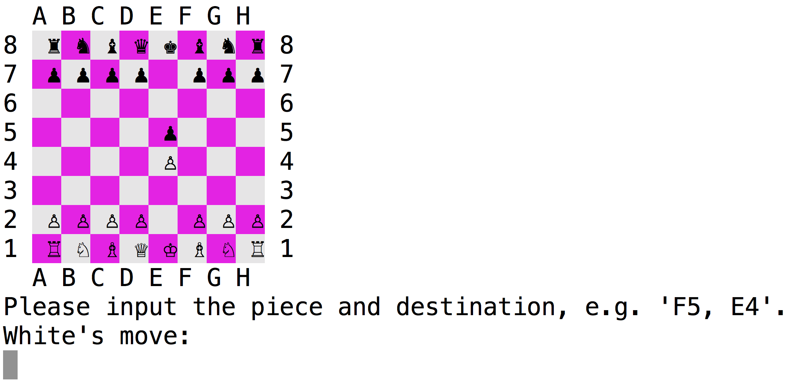

# Chess!

I had a lot of fun making this object-oriented chess game!

####It features:
  - Use of class inheritance to take full advantage of making multiple Pieces while staying DRY.
  - RSpec tests on pieces and the board with mock user input.
  - Using errors and rescuing them to their full advantage.
  - Colorize gem for clean UI.
